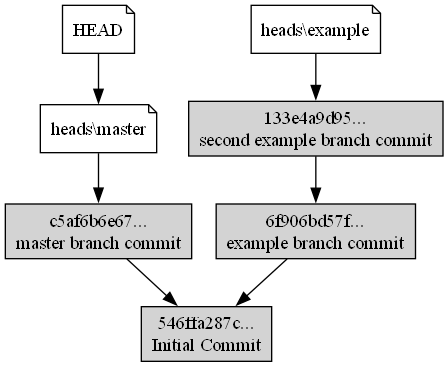
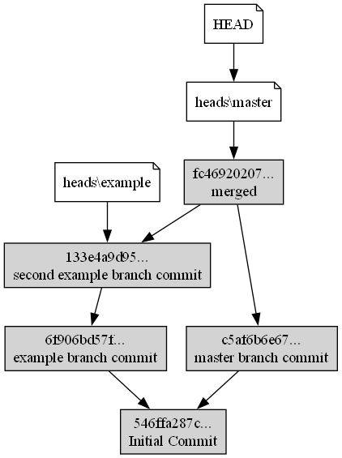
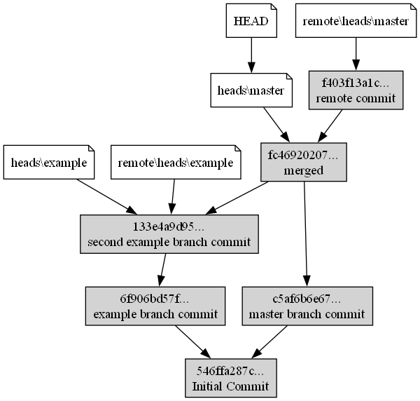
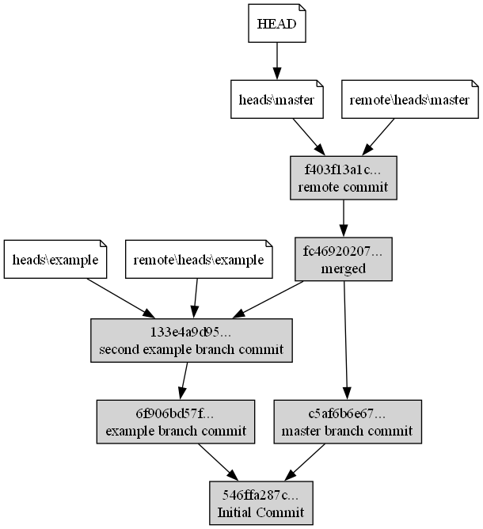
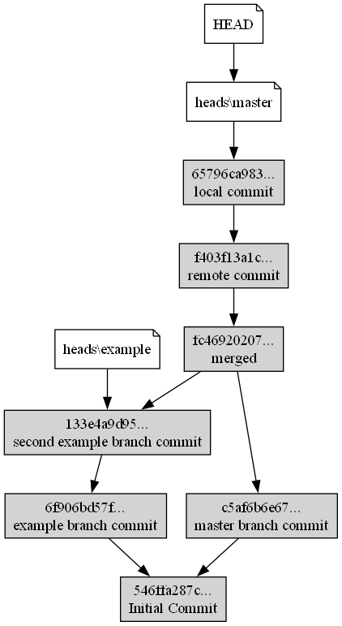

# Git Clone

A command-line application that simulates basic functionalities of Git, a distributed version control system. This project is designed for educational purposes, to understand how Git works under the hood by simulating its behavior with basic commands.

## Table of Contents
- [Overview](#overview)
- [Features](#features)
- [Installation](#installation)
- [Commands](#commands)
- [Usage](#usage)

## Overview

The Git Simulator is a lightweight tool that mimics key Git operations such as committing, branching, fetching, and pushing changes. While it is not as powerful as the official Git, it serves as a useful learning tool for those wanting to understand version control mechanics at a fundamental level.

## Features
- Simulates core Git functionalities:
  - `init`: Initialize a new repository.
  - `commit`: Create snapshots of file changes.
  - `branch`: Manage branches.
  - `merge`: Merge changes from one branch into another.
  - `status`: Show the working directory status.
  - `log`: View commit history.
  - `push`: Push changes to remote repository.
  - `fetch`: Get remote repository commits.
- Simple command-line interface.
- Educational focus on how version control works.

## Installation

### Prerequisites
- Python 3.x
- Unix command `diff` needs to be installed, as it is used to perform merge function.
- In order to gitc k be working graphviz needs to be installed, as dot language is used to create graph.

To install you can simply clone this repository, cd into it and run:
- ```pip install -e .```

It will install gitc as a package and allow you to use it.

## Commands
- `gitc init` : Initialize a new repository
- `gitc add` : Add working files
- `gitc commit -m "message"` : Commit changes to the repository
- `gitc status` : See your status (on which branch you are, what files are staged and not staged for commit)
- `gitc log` : History of commits
- `gitc k` : Graphic commit history (png file is saved inside .gitc directory)
- `gitc show` : Show changes from last commit
- `gitc diff` : See changes from a specific commit (with --cached see changes between last commit and working tree)
- `gitc reset` : Move HEAD to a specific commit (allows to undo commit)
- `gitc checkout` : Change between branches or commits
- `gitc tag` : Create a tag for commit
- `gitc branch` : See branches or create a new one
- `gitc merge` : Merge commits
- `gitc fetch` : Download commits from remote repository
- `gitc push` : Push commits to remote repository


## Usage

1. Create a new repository

```bash
gitc init 
# Initialized empty gitc repository in PATH
```
2. Create some sample files
  - You may check that files are not staged for commit using: `gitc status`

```bash
gitc status
###########
# On branch master
# 
# Changes to be committed:
#
#
# Changes not staged for commit:
#
#    new file: sample.txt
#    new file: sample1.txt
```

3. Add files ("." means every file)
```bash
gitc add .
```

```bash
gitc status
###########
# On branch master
#
# Changes to be committed:
#
#    new file: sample.txt
#    new file: sample1.txt
#
# Changes not staged for commit:
```

4. Commit changes
```bash
gitc commit -m "MESSAGE"
########################
# 546ffa287c2e752bc... 
```

```python
gitc log
########
# commit 546ffa287c2e752bc... (HEAD,refs\heads\master)
#
#     Initial Commit
```

5. Create new branch
```bash
gitc branch BRANCH_NAME
#######################
# Branch example created at 546ffa287c
```
```bash
gitc branch
#######################
#   example
# * master
```

6. Change branch
```bash
gitc checkout example
```
```bash
gitc branch
#######################
# * example
#   master
```

7. Create more commits to see their history
```bash
gitc k
######
# Succesfully saved commits history to file: PATH
```


8. Merge two branches
```bash
gitc merge example
######
# Merged in working tree
# Please commit
######
gitc commit -m "merged"
# fc4692020768f48dd3...
```


9. To see if fetch, push works a remote repository is needed. You can simply copy existing gitc repository and add more commits.

- Get remote repository commits
```bash
gitc fetch PATH
```

- Set local master branch on downloaded remote master branch
```bash
gitc merge remote/heads/master
######
# Fast-forward merge, no need to commit
```


- Push local changes
```bash
gitc push PATH BRANCH
```
Remote Repostiory History
